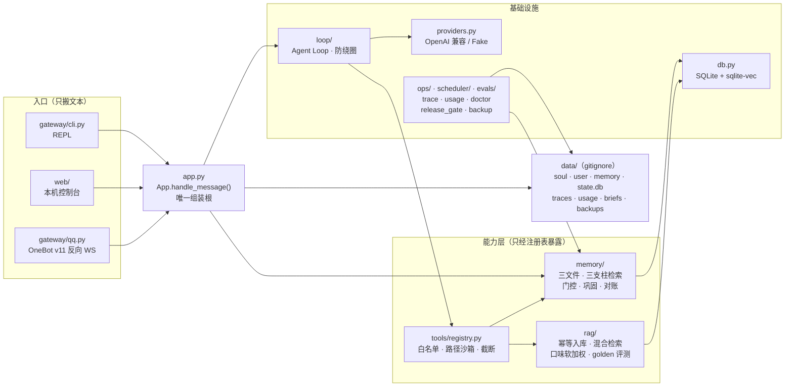

# yixiang（以湘）

**本地优先的个人 Agent：有记忆、有评测、有成本账。**

它不是一个"跑过一次"的 LLM demo，而是每天在用的助手——这个仓库里每一句"我没有退步"，都指得到一个可复算的数字。


跑在 Windows 10 上的"以湘"：记得我是谁、管学习计划与备忘、基于本地影视语料做按需推荐，全程可观测、可评测、可复算。QQ 入口与定时晨报都已落地，但**默认关闭**。

## 它和"聊天机器人 demo"的差别

三条可验证的工程事实，不是三个形容词：

1. **每轮现拼工作记忆**——人格（`soul.md`）+ 用户画像（`user.md`）+ 核心记忆（`memory.md`）+ 检索到的长尾 facts / episodes，由代码决定注入什么，不靠"希望模型记得"；
2. **每件事都留痕**——工具调用进 `data/traces/`（`ops tail` / `show-trace` 可回放），每次模型调用进 `usage.jsonl`（`ops cost --explain` 打印各段 token 占比）；
3. **退步会被拦住**——GitHub Actions 四步门禁 + `release_gate` 五项判定（确定性 100% / judge ≥4.0 / 门控漏检 0 / 检索 top-3 ≥60% / 成本告警）。判定逻辑只有一份，不在 YAML 里重写。

## 全景

四条支柱（入口 / Loop / 记忆 / RAG 语料）+ 一条横切面（评测与运维）。三层纪律撑起这张图：**入口只搬文本**、**能力只从注册表出去**、**组装根只有一个**。



一句话读图：`App.handle_message()` 是唯一把"上下文装配 + 检索门控 + Loop + 落盘 + 巩固"串起来的地方，所以"线上跑的那条路"与"用例跑的那条路"是同一条。架构与分层纪律的完整版见 [`docs/architecture.md`](./docs/architecture.md)。

## 快速开始

需要 Python 3.12 与 [uv](https://docs.astral.sh/uv/)（`python -m pip install uv`）：

```bash
uv sync                      # ① 建 .venv 并装依赖（默认不装 torch）
cp .env.example .env         # ② Windows: Copy-Item .env.example .env；然后把 YIXIANG_API_KEY 填进去
uv run yixiang chat          # ③ 开始对话（流式输出）
```

没有 API key 也能验证"真的跑起来了"——两条离线命令，零成本、零外网：

```bash
uv run yixiang doctor        # 八项启动自检：配置 / 目录 / SQLite / 向量扩展 / 模型探活 / 三文件 / 密钥可恢复性 / Bangumi 收藏 token
uv run yixiang rag eval      # 检索回归：top-3 命中率 + MRR（无 key 可跑；首次会下 100MB 嵌入模型，
                             #   想零下载就加 YIXIANG_EMBED_BACKEND=hash，那一路是离线假嵌入）
```

CLI 内的斜杠命令：`/help` `/new [名字]` `/history` `/tools` `/trace [n]` `/cost` `/exit`。

## 三个入口

### 一、CLI（主力）

`yixiang chat` 是日常形态：流式输出、斜杠命令、每轮回复后可查 trace 与成本。

### 二、本机 Web 控制台（七栏）

不想在终端里翻人设和记忆，就开一个本机前端。它只绑 `127.0.0.1`，用标准库实现，没有构建步骤，也装不上依赖这种东西：

```bash
uv run yixiang web        # 打开 http://127.0.0.1:8765/
```

七个面板对应测试时最常做的事：

| 栏 | 干什么 |
|---|---|
| **对话** | 流式逐字出；可中断、可继续；可带图（截图直接粘贴，模型真的看得到） |
| **历史对话** | 按会话翻往来，可改名 / 搜索 / 导出 / 删除，点一条即切过去 |
| **人设与记忆** | `soul.md` / `user.md` / `memory.md` 就地改，超限一个字节都不写 |
| **模型配置** | 主模型 / api_base / 上限 / 预算，写回 `.env` 并热生效（密钥只回掩码） |
| **提示词** | S1~S8 本轮实况，自查"模型到底看到了什么" |
| **QQ 设置** | 白名单校验：开了网关却没白名单直接拒 |
| **链路 trace** | 本轮迭代 / 工具调用 / tokens / 成本，与 `yixiang ops show-trace <turn_id>` 同源 |

上传的文件落在 `data/uploads/`（**单个上限 30MB**）。托盘里列的是磁盘上**现在**有什么，不是"这次传了什么"：图片给缩略图、随消息以多模态一起发给模型（8MB 以内模型真的看得到像素），普通文件点一下就把 `read_file` 调用填进输入框；每个文件都能单独删，也能一键清空。**QQ 里发来的图走同一条路**（同一个目录、同一条多模态通路）：图随那条消息进模型；只发图、还没打字时先回一句短回执，把图留给下一条文字（10 张封顶、5 分钟有效）。手边没文件可传，用 [`evals/fixtures/web_upload_sample.md`](./evals/fixtures/web_upload_sample.md) 当样张。

### 三、QQ（默认关闭）

OneBot v11 反向 WebSocket，配 NapCat 之类的一侧。Windows 上有一键脚本：双击 `启动以湘.bat` 拉起网关并挂上 NapCat，`状态以湘.bat` 只体检不改动，`停止以湘.bat` 只停网关、不动 QQ。脚本里的 NapCat 目录默认是作者本机路径，**换机器要改**（`scripts/qq_assistant.ps1` 顶部 `YIXIANG_NAPCAT_DIR`）。

安全默认是**拒绝一切**：`YIXIANG_QQ_ALLOWED` 为空时任何外部消息都不处理，群消息默认忽略（`YIXIANG_QQ_GROUP_ENABLED=0`），入口本身也要 `YIXIANG_QQ_ENABLED=1` 才生效。

## 它现在能做什么

**记忆**：三文件核心记忆（原子写 + 上限校验：3000 / 4000 / 活跃区 150 行）、三支柱检索（facts 走 FTS5 + 向量 RRF；episodes 只用向量；skills 关键词）、检索门控（规则预过滤 + 小模型判定，fail-open）、人机共治（手改 `memory.md` 重启即生效）、巩固（三档阈值 + watermark，失败不推水印）、"记住"硬契约、`memory {list,show,sync,verify,restore}` 三方对账。

**排期**：`create_plan` / `add_task` / `list_today` / `list_range`（一次答"这周 / 下周"，按天分组）/ `complete_task` / `reschedule_task`，`plans` / `plan_items` 是权威源。`data/your_plan.md` 是**和 `memory.md` 同级**、给人看也给人改的排期视图：改一行文字 = 改任务、删整行 = 移出排期、在某天下面手写一行 = 新增一条（同步后回写 `item_id`）。**两张文件分工不同**——`memory.md` 记"事实"（我是谁 / 偏好 / 长期在做什么），`your_plan.md` 记"排期"（哪一天做什么），别混。

**RAG 语料**：`source_id` 幂等入库（简介没变就跳过且不重嵌入）、中文混合检索（jieba 预分词 + LIKE 兜底 + RRF + 硬过滤 + 口味软加权）、推荐去重（7 天窗口，对话与日报共用）、`ops explain-search` 五段可解释（FTS / 向量 / RRF / 过滤 / 加权）、`rag eval` golden 回归、嵌入不可用时降级纯 FTS5（trace 记 `E_EMBED_UNAVAILABLE`，用户无感）。外部内容一律 `<external_content>` 包裹。

**工具**：注册表里第 22 个具名工具（备忘 / 计划 / 一周视图 `list_range` / 改期 / 记忆管理 / 影视 / 日报 / `read_file`），路径、SQL、命令一律由代码拼装，不由模型输出拼接——模型可以建议，只有代码做决定。

**评测与运维**：确定性用例、judge 10 条 rubric、检索 golden 回归、发布门禁五项、trace / usage / doctor / backup / 恢复演练、常驻 job（巩固兜底 / 每日汇总 / 周巡检，异常隔离——失败可见，绝不杀主链路）。

## 真实数字

全部实测，且每条都有复算命令（原始数据见 [`docs/NUMBERS.md`](./docs/NUMBERS.md)）。

| 指标 | 值 | 口径 |
|---|---|---|
| 离线确定性用例 | **416 passed, 1 deselected**（36 个文件，~9 秒） | `-m "not live"`，离线、零成本、零抖动 |
| 检索 top-3 命中率（CI 口径） | **90.0%（18/20）· MRR 0.792** | 31 部语料 + `hash` 假嵌入 |
| 检索 top-3 命中率（真语料 + 真嵌入） | **90.0%（18/20）· MRR 0.792** | 333 部语料 + `bge-small-zh-v1.5` |
| 嵌入不可用降级 | **85.0%（17/20）** | 纯 FTS5，产品仍然可用 |
| 门控漏检率 | **0%**（硬门禁） | 20 条"该检索"全命中；误检 10%（容忍 ≤30%） |
| judge 均分 | 离线 **4.80** / live **4.60**（门线 4.0） | live 的裁判已换到本机 Ollama，边际成本 ¥0 |
| 单日模型成本 | **¥0.21–0.48**（预算 ¥0.5/天） | 40 轮对话 + 40 次门控 + 5 次巩固 + 1 次日报 |

## 数据边界（诚实版本）

声称"数据完全本地"是不成立的：每轮拼好的 prompt 会发给模型供应商。真实边界如下——

| 数据 | 是否离开本机 |
|---|---|
| `data/soul.md` / `user.md` / `memory.md`、`state.db`、trace、备份 | **否** |
| 嵌入计算（bge-small-zh-v1.5，本地 CPU 推理） | **否** |
| 每轮拼好的 prompt（**含被注入的记忆片段、检索到的语料片段**） | **是**，发给所选模型供应商 |
| QQ 消息内容 | 是，先经腾讯服务器 |
| 影视语料元数据（**入库阶段**，一次性） | 是，从 Bangumi / TMDb 拉取并缓存在 `data/raw/` |
| Bangumi live 检索（**对话阶段**，`bangumi_search` / `bangumi_subject` / `bangumi_my_collections`） | **是**，当场请求 `api.bgm.tv`（读自己的收藏要 PAT；搜索与条目详情免 token） |

缩小出网面的路线是明确的：门控与巩固换本地小模型（`.env` 的 `YIXIANG_GATE_MODEL` / `YIXIANG_UTILITY_MODEL` 配置位已就绪）、嵌入已经是本地、检索片段按需注入而不是全量塞入。**先把边界写清楚，再谈缩小**——反过来做，最容易在答辩时被一句话戳穿。

## 四层评测与发布门禁

一条纪律：**依赖越多的层跑得越少**。这不是省事，是不让外部 API 的抖动阻塞开发，也不让成本随提交次数线性增长。

| 层 | 内容 | 什么时候跑 | 成本 |
|---|---|---|---|
| **L1 单元** | 纯函数与单模块：解析、截断、计价、幂等键… | 每次保存 | 0 |
| **L2 集成** | 假 Provider 驱动的完整轮次：工具调用、门控、巩固、调度、安全 | PR + CI | 0 |
| **L3 检索回归** | golden 集上的 top-3 命中率与 MRR | PR + CI（离线嵌入后端）+ nightly 真嵌入 | 0 |
| **L4 judge** | 10 条 rubric（闲聊 / 推荐 / 计划 / 记忆管理 / 情绪陪伴） | nightly + 发版前（`--live`） | ≈¥0.06/次 |

```bash
uv run pytest evals/deterministic -m "not live"   # L1+L2+L3：离线、零成本、≤30 秒
uv run yixiang eval judge                         # L4：离线基线自检（有 key 时 --live 走真模型）
uv run yixiang eval gate                          # 门控用例：漏检 = 0 是硬门禁
uv run python -m yixiang.ops.release_gate         # 五项汇总判定：退出码 0 = 可以合并
uv run ruff check .                               # 静态检查
uv run yixiang skills validate                    # 技能文件格式
```

发布门禁的五项与阈值（改动等于改考核标准，只写在 `yixiang/ops/release_gate.py` 一处）：

| 检查 | 阈值 | 性质 |
|---|---|---|
| 确定性用例通过率 | 100% | 硬门禁 |
| judge 均分 | ≥4.0 / 5 | 硬门禁（**只当回归警报**，不当质量结论） |
| 门控漏检率 | = 0（误检容忍 ≤30%） | 硬门禁（漏检 = 失忆，产品级事故） |
| 检索 top-3 命中率 | ≥60% | 硬门禁 |
| 单轮成本 | ≤日预算 ×1.5 | **只告警**，不阻止合并 |

两条容易踩的口径：

- **检索评测关口味**：门禁量的是"相关性排序有没有退步"，数字不能随 `user.md` 内容漂移。带口味的排序只出现在 `ops explain-search` 与 `yixiang brief` 里；
- **live 用例不进 PR**：外部 API 抖动不该阻塞开发。nightly 与发版前手动 `uv run yixiang eval --live`。

judge 的局限主动交底：用与 main 同族的模型自评，存在偏好偏差。三条缓解同时在场——阈值只当回归警报、可客观判断的部分（工具调没调 / 参数对不对 / 有没有编造）**下沉成确定性断言**、换 judge 模型时重跑全部历史分数再比（已执行过一次：裁判换到本机 `qwen3.5`）。

## 目录结构

```
yixiang/         包本体
  runtime/       模型客户端、时钟、会话状态（每轮装配的唯一入口）
  loop/          Agent Loop 与防绕圈护栏
  tools/         工具定义与注册表（memo / plan / 记忆 / 影视）
  memory/        三文件核心记忆、三支柱检索、门控、巩固、人机共治
  rag/           影视语料：ingest/（入库）+ retrieve/（检索）+ 口味加权 / 评测 / 嵌入
  gateway/       入口层：cli.py（REPL）/ qq.py（OneBot v11 反向 WS）/ sinks.py（投递通道）
  web/           Web 控制台：console.py（业务适配）+ server.py（HTTP/SSE/静态文件）+ static/（手写前端，无构建）
  scheduler/     常驻 job：jobs.py（巩固兜底 / 每日汇总 / 周巡检）+ brief_job.py（晨报）+ runtime.py
  ops/           trace、usage、doctor、explain-search、release_gate、backup
templates/       soul.md / user.md / memory.md 的初版模板（仓库只放模板）
data/            运行时数据（gitignore）：三文件、your_plan.md（排期视图，与 memory.md 同级）、
                 state.db、traces/、usage.jsonl、briefs/、backups/
                 └ 它同时是一个**私有仓**：只版本化三文件 / skills / briefs，永不推远端
evals/           deterministic/（L1+L2+L3）+ live/（`-m live` 真模型）+ golden/ + judge/ + fixtures/
docs/            PRODUCT.md、TECH-DESIGN.md、architecture.md、NUMBERS.md、HANDOFF.md、
                 SECRETS-RECOVERY.md、golden-decisions.md、TODO-AFTER-PART-4.md、parts/
scripts/         demo 剧本与恢复演练脚本
.github/         workflows/ci.yml（四步门禁）
```

## 命令速查

```bash
uv run yixiang chat                     # 交互式对话（流式）
uv run yixiang web                      # 本机 Web 控制台（http://127.0.0.1:8765/）
uv run yixiang doctor                   # 八项启动自检
uv run yixiang migrate                  # 应用数据库迁移
uv run yixiang brief                    # 按需日报：今日安排 + 1 条影视推荐
uv run yixiang rag ingest --source local --file evals/fixtures/media_sample.json   # 离线入库 31 部
uv run yixiang rag eval                 # golden 集：20 条 + 10 条 holdout
uv run yixiang ops explain-search "讲时间循环的"    # 五段中间结果：FTS / 向量 / RRF / 过滤 / 加权
uv run yixiang ops cost --day           # 今日 token 与成本（--explain 打印分段占比）
uv run yixiang ops tail                 # 实时跟随今天的 trace
uv run yixiang memory verify            # 记忆三方对账：memory.md / 数据库 / FTS 索引
uv run yixiang backup                   # state.db 日快照 + data/ 私有仓提交
uv run python scripts/restore_drill.py  # 恢复演练：快照当唯一库源启动一次并逐项对账
uv run yixiang --help                   # chat / web / serve / doctor / rag / brief / ops / eval / migrate / memory / skills / backup
```

## 边界（写在明面上）

- **留在门禁外的入口不进任何门禁**：定时晨报与唤醒补发（`scheduler/brief_job.py` + `gateway/sinks.py`）与 QQ 入口（`gateway/qq.py`）都已落地，但默认关闭，`release_gate` 不判它们；B 站 / Pixiv 两个工具仍是设计位；
- **成本数字是模型算出来的，不是账单跑出来的**：口径与算法都摆出来了，真实账单要等使用一周后才有；
- **judge 离线分不代表回复质量**：离线只证明题面、解析器与留痕管线没坏，语气与合理性只有 `--live` 能判；
- **真抓语料与真嵌入需要网络**：离线等价入口是 `--source local --file evals/fixtures/media_sample.json`（31 部）+ `YIXIANG_EMBED_BACKEND=hash`；
- **降级优先于不可用**：记忆装配失败仍可聊天（三文件照读、检索缺席）；嵌入拿不到退纯 FTS5；常驻 job 抛异常只留痕。

PART 3 交付时留下的 6 个决策点记在 [`docs/TODO-AFTER-PART-4.md`](./docs/TODO-AFTER-PART-4.md)。

## 文档

| 文档 | 回答什么问题 |
|---|---|
| [`docs/PRODUCT.md`](./docs/PRODUCT.md) | 做什么、给谁用、为什么是这个形态（WHAT / WHY） |
| [`docs/TECH-DESIGN.md`](./docs/TECH-DESIGN.md) | 怎么实现：数据流、ADR、冻结接口、安全与成本模型（HOW） |
| [`docs/architecture.md`](./docs/architecture.md) | 一页看懂：入口 / Loop / 记忆 / RAG / 评测四支柱 + 分层纪律 |
| [`docs/NUMBERS.md`](./docs/NUMBERS.md) | 三张数字卡（成本 / 命中率 / 用例数）的原始数据与算法 |
| [`docs/HANDOFF.md`](./docs/HANDOFF.md) | 交接说明：现状、口径与坑位清单 |
| [`docs/SECRETS-RECOVERY.md`](./docs/SECRETS-RECOVERY.md) | 密钥丢了怎么恢复（`.env` 可恢复副本） |
| [`docs/golden-decisions.md`](./docs/golden-decisions.md) | 冻结的评测基线：为什么这些答案不许改 |
| [`docs/TODO-AFTER-PART-4.md`](./docs/TODO-AFTER-PART-4.md) | 还欠的决策点与会话记录 |
| [`docs/parts/`](./docs/parts/) | 按周切分的 4 个工作包与各自的验收命令 |
| [`scripts/`](./scripts/) | 每周演示剧本（照读即可，含无网络兜底）与恢复演练脚本 |

## 参考与致谢

四支柱划分（Harness / Loop / Memory / Eval-Ops）与若干关键设计（检索门控、三支柱记忆、trace + 发布门禁）借鉴自 [AI-Engineer-from-scratch](https://github.com/ShenSeanChen) 课程第 12 模块的 hermes 剪枝版（waku-agent）。**核心代码（loop / memory / gateway / provider）自行实现**，以"每一行都能讲清楚"为验收标准；工具与评测借鉴思路后重写。

## 许可

仓库暂未指定开源协议（作者保留权利）。如果你要基于它做二次开发，先开 issue 说一声。
