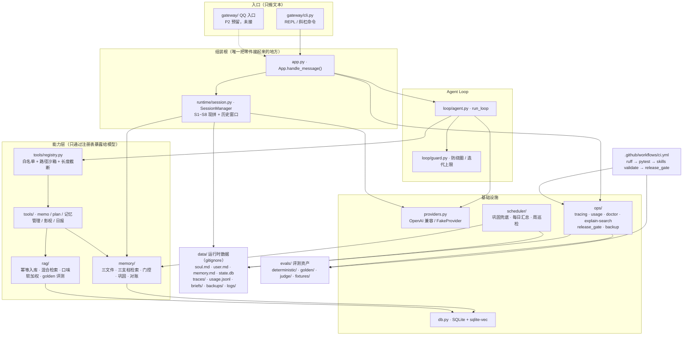
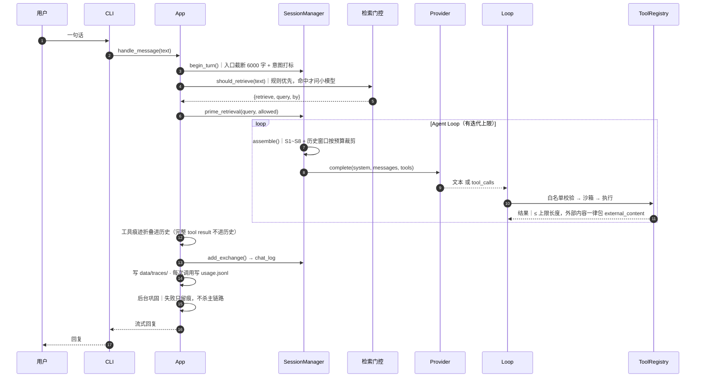

# 架构：四条支柱与四条依赖方向

> 版本 v1.0 · 2026-09-20 · 对应实现：PART 1~4 全部收口
> 上游设计：[`TECH-DESIGN.md`](./TECH-DESIGN.md)（§1 总览、§5 Loop、§6 上下文、§7 记忆、§8 检索、§11/§13 评测）
> 本页的定位：**画地图，不重复细节**。算法参数、DDL、失败语义一律以 TECH-DESIGN 为准；这里只回答两个问题——
> "它由哪几块拼成"与"哪几块之间不许互相依赖"。

---

## 0. 一句话

本地优先的个人 Agent：**每轮现拼工作记忆 → 走一次 Agent Loop → 每一轮都落 trace 与成本账 → 由发布门禁守住退步**。

四条支柱（入口 / Loop / 记忆 / RAG 语料）撑起这个行为，一条横切面（评测与运维）证明它没有偷偷退步。

## 1. 全景图

读图的三条提示：

1. **`app.py` 是唯一的分叉点**：CLI、P2 的 QQ、评测脚本都只调 `App.handle_message()`。入口里没有业务逻辑（ADR-3），所以"线上跑的那条路"与"用例跑的那条路"是同一条；
2. **`memory/` 与 `rag/` 各自独立**，只在 `db.py`、`runtime/models.py` 这两个中立层相遇——记忆的门控与检索质量互不干扰；
3. **`evals/` 只被读，不被依赖**：生产代码不 import 用例。唯一的例外是 `ops/release_gate.py` 在门禁进程里按路径加载 `evals/judge/run_judge.py` 与 `test_gate.py` 的纯函数（复用同一份判定口径，避免"用例绿了门禁红了"）。

## 2. 一轮对话的时序

三个不显眼但必须记住的点：

- **截断发生在 `begin_turn()`**，不在 `assemble()`。用户消息在 prompt / `chat_log` / trace 三处必须是同一个字符串，否则"检索用了什么"和"记下来的是什么"会对不上（T-8）；
- **检索一轮只做一次**：结果缓存在 `SessionManager._retrieval`，`system_blocks()` 每次迭代都被调但不会重复检索；
- **工具结果不进历史**，只留一行折叠摘要——省 token，也避免自动前缀缓存被击穿（§4.5、§5.3）。

## 3. 四条支柱各管什么

| 支柱 | 代码 | 管什么 | 明确不管什么 |
|---|---|---|---|
| **入口** | `gateway/cli.py`、P2 的 `gateway/` QQ 入口 | 读一行、打流式输出、斜杠命令（`/new` `/history` `/tools` `/trace` `/cost`） | 不含任何业务判断；换入口不改业务 |
| **Loop** | `loop/agent.py`、`loop/guard.py` | 迭代上限、防绕圈、工具调用编排、`finish_reason=length` 与坏 JSON 的失败路径 | 不认识"记忆"和"语料"这两个概念 |
| **记忆** | `memory/` | 三文件核心记忆（原子写 + 上限校验）、三支柱检索（facts / episodes / skills）、检索门控、巩固与 watermark、人机共治、三方对账 | 不做影视语料的入库与推荐 |
| **RAG 语料** | `rag/` | `source_id` 幂等入库、中文混合检索（FTS5 + 向量 + RRF）、硬过滤 + 口味软加权、7 天去重、golden 回归 | 不写长期记忆（推荐历史写 `recommend_log`，不是 `facts`） |
| **评测与运维**（横切） | `ops/`、`scheduler/`、`evals/`、`.github/` | trace / usage / doctor / explain-search / release_gate / backup / 常驻 job | 不参与业务决策；门禁只判"有没有退步" |

## 4. 四条依赖方向（违反一条就算架构事故）

| # | 方向 | 规则 | 违反的后果 |
|---|---|---|---|
| 1 | 入口 → 业务 | 入口只 import `App` 与渲染工具（`ops/show_trace`、`ops/usage`）；业务只在 `App.handle_message()` 里 | 逻辑分叉成两份，评测测的路径与线上不是同一条 |
| 2 | Loop → 能力 | Loop 只通过 `ToolRegistry` 的**具名工具**触达能力；路径、SQL、命令一律由代码拼，不由模型输出拼 | 一句注入就变成任意文件读写 / 任意 SQL |
| 3 | 记忆 ↔ 语料 | `memory/` 不 import `rag/`；`rag/` 只单向复用 `memory/` 里的两个纯函数（`preprocess_for_fts`、`rrf`）与常量 | 双向引用会变成循环依赖，且两套检索口径互相污染 |
| 4 | 生产 → 评测 | 生产代码不 import `evals/`；只有 `ops/release_gate.py` 在门禁进程里按路径加载用例的纯函数 | 判定口径出现第二份，改一处漏一处 |

第 3 条是**实测出来的现状**，不是理想图：`rag/retrieve.py` 确实从 `memory.semantic` 复用了 `RRF_K`、`Hit`、`_cut`。收益是"分词与融合的口径只有一份"，代价是语料的用例会拉起记忆模块。如果将来要拆包，第一步是把这两个纯函数下沉到 `runtime/` 或一个新的 `text/` 模块。

## 5. 分层纪律：依赖越多跑得越少

评测不是"测试数量的多少"，而是**每一层花在哪、多久跑一次**（TECH §13.1）：

| 层 | 是什么 | 跑在哪 | 依赖 | 时间 / 成本 |
|---|---|---|---|---|
| **L1 单元** | 纯函数：解析、截断、计价、幂等键、RRF、rubric 打分 | 每次保存 | 无 | 毫秒级 / 0 |
| **L2 集成** | FakeProvider 驱动的完整轮次：Loop、工具、门控、巩固、调度、安全 | PR + CI | 假模型、临时库、假时钟 | 全量 ≈5 秒 / 0 |
| **L3 检索回归** | `evals/golden/media.jsonl` 的 top-3 与 MRR | PR + CI | 需嵌入（CI 用 `hash` 后端，不下载模型） | ≈1 秒 / 0 |
| **L4 judge** | 10 条 rubric，五类各 2 条（闲聊 / 推荐 / 计划 / 记忆管理 / 情绪陪伴） | nightly + 发版前 | 真模型（`--live`） | ≈¥0.06 / 次 |

同一条纪律的另一面，是**假 Provider 是整个体系的地基**：它让"Agent 的行为"第一次变成可测对象——全量 L1+L2 跑完 ≤30 秒、零成本、零抖动，还能稳定复现真模型难复现的失败路径（超时、`finish_reason=length`、工具参数是坏 JSON）。

当前实测（2026-09-20）：`162 passed, 2 skipped`（2 条属 P2 的 D-13 / D-27，标 `skip`），全量 **4.5 秒**；`-m "not live"` 离线、零成本。原始数据见 [`NUMBERS.md`](./NUMBERS.md)。

## 6. 数据落盘地图

运行时状态全部在 `data/` 下（被 gitignore；它自己是一个**私有仓**，只版本化三文件 / `skills/` / `briefs/`）：

| 路径 | 是什么 | 谁写 | 谁读 |
|---|---|---|---|
| `data/soul.md` `user.md` `memory.md` | 人格 / 画像 / 核心记忆，人可手改 | 模型（经工具）+ 用户 | 每轮装配 `S1~S4` |
| `data/state.db` | SQLite：`chat_log`、`facts`、`episodes`、`media`、`scheduled_runs`… + sqlite-vec 索引 | 各子系统 | 各子系统 |
| `data/traces/*.jsonl` | 一行一轮：门控决策、工具调用、耗时、注入分段长度 | `ops/tracing.py` | `ops tail` / `show-trace` |
| `data/usage.jsonl` | 一行一次模型调用：角色、token 三段、成本 | `providers.py` | `ops cost --explain`、23:50 汇总 job |
| `data/briefs/YYYY-MM-DD.md` | 按需日报（同日覆盖，便于 diff） | `tools/brief.py` | 用户、P2 的投递层 |
| `data/backups/state-YYYYMMDD.db` | `VACUUM INTO` 日快照，保留 30 天 | `ops/backup.py` | 恢复演练 / 灾难恢复 |
| `data/logs/jobs-*.jsonl` | 常驻 job 的每次执行（成功 / 失败 / 跳过 + 耗时） | `scheduler/jobs.py` | 人工排障 |

为什么 job 日志**不**写进 `data/traces/`：trace 的契约是"一行一轮对话"，`ops tail` 与 `--explain` 都按这个假设读它。混进别的记录类型，会让每一处读取都变成需要分支判断的联合类型——日志是日志，trace 是 trace。

## 7. 边界（写在明面上）

- **P2 的东西不进任何门禁**：定时晨报推送与唤醒补发、QQ 入口、B 站 / Pixiv 工具都只预留接口（`scheduler/brief_job.py`），`release_gate` 不判它们。P2 做完也**不回头改门禁**，`skip` 转为实跑即可；
- **数据边界是诚实的**：每轮拼好的 prompt（含注入的记忆与检索片段）会发给模型供应商，QQ 消息经腾讯，影视语料元数据入库阶段从 Bangumi / TMDb 拉取；三文件 / `state.db` / trace / 备份与嵌入计算不出网。完整表在 [`../README.md`](../README.md) 的"数据边界"一节；
- **降级优先于不可用**：记忆子系统装配失败仍可聊天（三文件照读、检索缺席）；嵌入拿不到退纯 FTS5 并记 `E_EMBED_UNAVAILABLE`；常驻 job 抛异常只留痕，绝不杀主链路。

## 8. 三句话讲这张图

1. **组装根只有一个**：`App.handle_message()` 是唯一把"上下文装配 + 门控 + Loop + 落盘 + 巩固"串起来的地方，所以流程图画一次就够，改一处不会漏三处；
2. **能力只从注册表出去**：模型能做的事被收窄成一张具名工具表，"模型可以建议，但只有代码做决定"；
3. **退步会被拦住**：CI 四步 + `release_gate` 五项，判定逻辑只有一份——`ruff` 先、判定最后，成本超预算只告警不拦合并。
